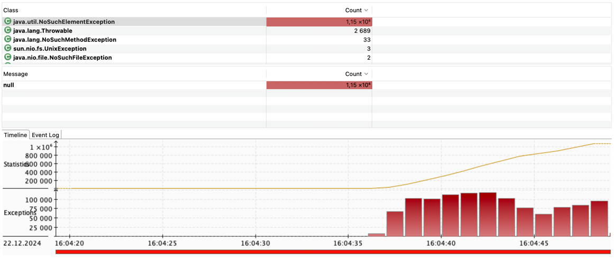
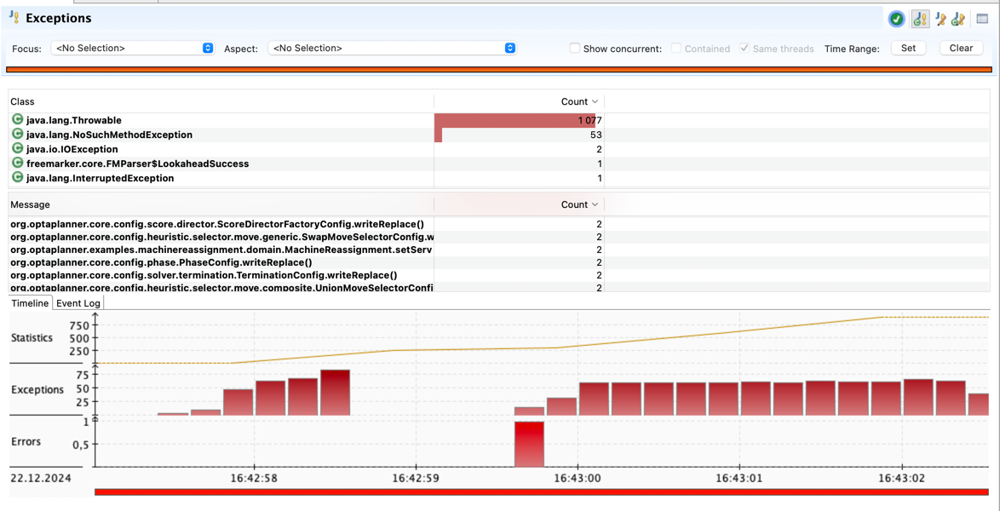

## Machine reassignment

|        | time spent | best score             | score calculation speed |
|--------|------------|------------------------|-------------------------|
| before | (11226)    | (0hard/-283722708soft) | (269693/sec)            |
| after  | (9499)     | (0hard/-283722708soft) | (318726/sec)            |

## Причина
Большое число выбрасываний исключения NoSuchElementException

### Before

| Stack Trace                                                                                | Count   | Percentage |
|--------------------------------------------------------------------------------------------|---------|------------|
| long org.optaplanner.examples.machinereassignment.domain.MrProcess.getUsage(MrResource):75 | 1153848 | 100 %      |

### After

## Что было проделано

Убрал выбрасывание исключения, заменил на возвращение 0. 

Удалил мапу usage за ненадобностью хранения элементов > 0.

В родительских вызовах убрал блок try catch