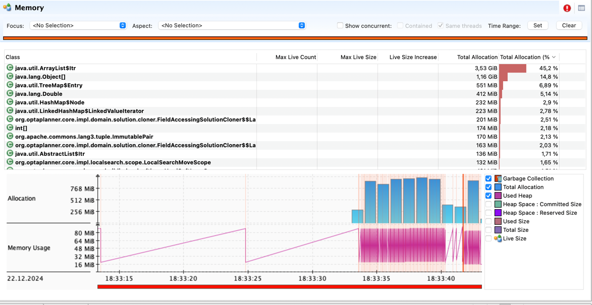

## Machine reassignment

|        | time spent | best score             | score calculation speed |
|--------|------------|------------------------|-------------------------|
| before | (9534)     | (0hard/-283722708soft) | (317556/sec)            |
| after  | (7502)     | (0hard/-283722708soft) | (403569/sec)            |

|        | Top 1 class name                                 | Total Allocation | Total Allocation (%) |
|--------|--------------------------------------------------|------------------|----------------------|
| before | org.apache.commons.lang3.builder.HashCodeBuilder | 23.9 GB          | 58.62 %              |
| after  | java.util.ArrayList$Itr                          | 3.53 GB          | 45.2 %               |

## Причина
Большое число аллокаций для класса HashCodeBuilder в классе AbstractPersistable

### Before

### After

## Что было проделано

Переписал вычисление hashcode без использования HashCodeBuilder
